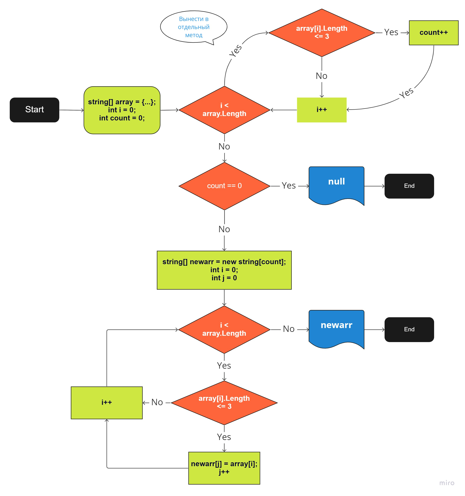

# Контрольная работа № 1

(По итогам вводного курса GeekBrains, август-октябрь 2022 г.)
___

## Условия задачи

Написать программу, которая из имеющегося строкового массива создаст новый массив, в который войдут строковые элементы с количеством символов, равным 3 или меньше.

Ввести первоначальный массив допускается с клавиатуры, либо задать на старте алгоритма.  

Примеры:  

```
["hello", "2", "world", ":-)"]              ->  ["2", ":-)"]  
["1234", "-2", "computer science", "****"]  ->  ["-2"]
["Kazan", "Moscow", "Cheboksary"]           ->  []
```

## Алгоритм решения

### Блок-схема

[Посмотреть на доске Miro](https://miro.com/app/board/uXjVPOwN4AI=/?share_link_id=50879651006)



### Описание алгоритма  

1. Задаем массив строк и заполняем его строковыми элементами (например, через ввод с клавиатуры пользователем).  
2. Запускаем цикл, в ходе которого подсчитываем, сколько строковых элементов массива имеют длину 3 или меньше символов. Полученное значение будет размером будущего массива.  
3. Если в массиве отсутствуют искомые элементы, сообщаем об этом пользователю и завершаем алгоритм. В случае наличия таких элементов переходим к шагу 4.  
4. Задаем новый массив строк размером, равным значению, которое мы получили на шаге 2.  
5. Запускаем цикл, аналогичный тому, что был на шаге 2, в ходе которого элементам нового массива присваиваются значения строковых элементов первоначального массива, если длина этих элементов равна 3 или меньше символов.
6. Выводим в консоль новый массив строк и завершаем алгоритм.

> [!NOTE]
> Есть более удобные алгоритмы с одним циклом без подсчета размера нового массива.  
Вышеописанный алгоритм основан построен исключительно на основе объема знаний, полученных в вводном курсе "Знакомство с языками программирования. C#"
